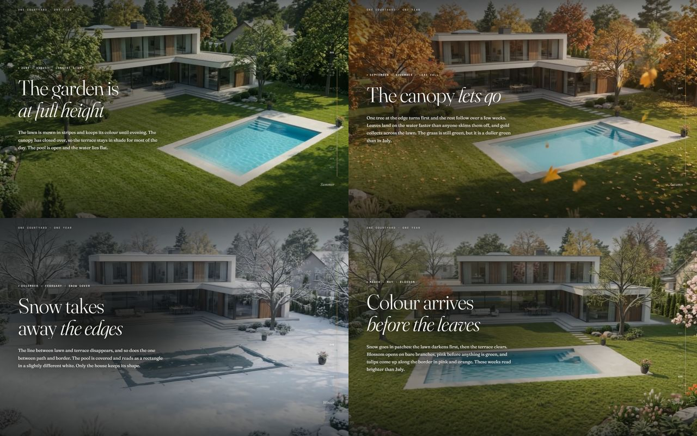

# The house holds still. The year does not.

A scroll film: one courtyard in a single continuous shot, with twelve months
passing through it. Scroll position drives the position in the film.

**Live: https://yuraitdeveloper14.github.io/seasons-scroll/**



```
index.html          the whole site — markup, styles and logic in one file
assets/
  year-1280.mp4     desktop cut: 1280×720, 60 fps, 596 frames, 15.1 MB
  year-960.mp4      phone cut:    960×540, 60 fps, 596 frames,  7.0 MB
  poster.jpg        social/meta still
```

Tools, not needed to run the site: `dewatermark.py`, `encode-final.py`,
`encode-test.py`, `scrub-test.py`, `measure-contrast.py`, `shots/`.

## Run

```bash
npx --yes serve -l 4173 .
```

Static: any server works. `file://` will not — browsers refuse to scrub a
video loaded from a local file.

## The two things that were wrong, and what fixed them

### The watermark

The source carries a four-point sparkle at a fixed position, frame box
x 1114–1183, y 576–622. It is a semi-transparent white overlay:

    out = (1 - a) · bg + a · 255

so it was solved away rather than painted over. Alpha was measured on the
summer frames, where the lawn underneath is dark and smooth: a quadratic
surface fitted to the ring around the mark predicts the background, and
`a = (out − bg) / (255 − bg)`. A dark background gives a large `(255 − bg)`,
which is what makes that estimate stable. The mark's anti-aliased rim is a
sub-pixel blend that no single alpha can undo, so that ring alone — about
two pixels wide — is filled from its neighbours.

Deviation of the mark's box from a smooth fit of its surroundings:

| time | source | delivered |
|---|---|---|
| 0.4 s | 19.6 | 5.0 |
| 1.5 s | 21.4 | 7.2 |
| 3.7 s | 26.4 | 13.7 |
| 6.2 s | 11.0 | 6.2 |

Run `dewatermark.py` again if the source is replaced.

### The quality

The first build encoded every frame as a keyframe. That makes seeking
trivial, but all-intra costs roughly three times the bits of a short GOP for
the same picture, and the frame count had also gone from 240 to 596. The
result was 18 KB per frame against the source's 41 KB, and it looked it.

The fix is a short GOP. Setting `currentTime` performs an *accurate* seek —
the decoder starts at the nearest keyframe and walks forward — so a GOP of 12
costs at most twelve frame decodes, while P-frames exploit the very large
redundancy between frames 1/60 s apart.

Measured against the source frames (`encode-test.py`):

| encode | size | per frame | SSIM |
|---|---|---|---|
| all-intra crf 29 (first build) | 11.2 MB | 19.2 KB | **0.875** |
| GOP 12, crf 19 | 10.5 MB | 18.0 KB | 0.987 |
| **GOP 12, crf 17 (shipped)** | **15.1 MB** | **25.9 KB** | **0.989** |
| GOP 6, crf 17 | 23.0 MB | 39.4 KB | 0.989 |
| GOP 4, crf 17 | 27.0 MB | 46.4 KB | 0.989 |

Shortening the GOP below 12 buys no quality, only bytes.

A short GOP does make each seek decode more frames, and that first showed up
as the frame rate dropping to 32 fps on a slow drag. It turned out not to be
the decoder: the scroll loop was calling `getBoundingClientRect` on every
chapter every frame, forcing a layout each time. Caching that geometry
brought it back to 52–58 fps.

## What would actually raise quality further

The source is 1280×720. That is the ceiling, and on a 1440 px-wide screen the
film is already being upscaled. Nothing in the encode can add detail that was
never there. If the clip can be re-rendered, the useful changes are, in order:

1. **1920×1080 or 2560×1440.** The single biggest gain.
2. **Native 60 fps.** The delivered film is interpolated from 24 fps with
   motion compensation. It holds up well on this footage — the fast-moving
   parts are falling leaves, already motion-blurred — but real frames are
   always better than invented ones.
3. **No watermark on the export**, so nothing has to be reconstructed.
4. **12–15 seconds instead of 10.** More frames spread over the same scroll
   means finer stepping.

Aspect ratio should stay 16:9, and the camera should keep its slow single
move: the whole idea is one continuous shot.

## Design notes

**Chapters land on their own season.** The seasons in the film are not evenly
spaced — summer is over by a quarter, blossom only arrives at the very end —
but the chapters are evenly spaced down the page. `filmAt()` is a monotonic
piecewise-linear map from scroll position to film position, so each chapter
sits on the season it describes. Verified: summer lands on source frame 29,
autumn on 96, winter on 160, spring on 222.

**The scrim follows the film's own brightness.** The luminance of the band
where the type sits was measured across all 240 source frames and is baked in
as `LUMA`. The overlay runs 0.30 over a summer lawn and 0.62 over open snow.

**The accent colours come from the frames**, not from a palette: `#8CA344`
grass, `#C08B3E` autumn leaf, `#8FA3AA` winter shade, `#D79E89` blossom. They
cross-fade as the year turns.

**The year rule** on the right is twelve months, June through May, placed at
each season's real span in the film rather than at even intervals.

**On a phone the frame is not cropped.** `object-fit: cover` in portrait left
a narrow vertical slice of a 16:9 courtyard, which loses the composition. In
portrait the film is shown whole, as a band that fades into the ground, with
the type below it.

Type is **Fraunces** (display and body, with its WONK axis on for headings)
and **Martian Mono** (labels, months, rule).

## Measured

Real Chrome, `--headless=new` so there is a real compositor, 1440×900:

| gesture | rAF | lag avg / max | settle |
|---|---|---|---|
| slow drag 40 px / 60 ms | 56 fps | 0.117 s / 0.252 s | 217 ms |
| wheel 120 px / 50 ms | 58 fps | 0.374 s / 0.596 s | 102 ms |
| fast flick 400 px / 30 ms | 59 fps | 1.647 s / 3.186 s | 375 ms |

596 frames over a 3600 px scroll span — 6.04 px of scroll per frame. Lag
while moving is the damped follower doing its job; after the gesture the film
converges in 0.1–0.4 s and always reaches the target frame.

Text contrast, measured on the rendered page rather than modelled
(`measure-contrast.py`) — glyph strokes against the background they sit on:

| chapter | heading | body | label |
|---|---|---|---|
| hero | 12.8 | 8.1 | 4.7 |
| summer | 11.6 | 7.8 | 7.2 |
| autumn | 12.2 | 8.3 | 8.9 |
| winter | 14.5 | 8.8 | 7.1 |
| spring | 13.1 | 8.6 | 5.5 |

Lowest anywhere 4.7 : 1, above the AA threshold of 4.5 for body text.

Also checked: `prefers-reduced-motion` removes the damping and the word
animation while the film still tracks the scroll; no failed requests; no
horizontal scroll from 360 to 2560 px; the page opens on its first decoded
frame rather than waiting for the whole file.

## Rebuilding the film from a new source

```bash
# 1. frames out
ffmpeg -i source.mp4 -fps_mode passthrough frames_png/%04d.png
# 2. remove the watermark (edit ROI in the script if it moves)
python dewatermark.py
# 3. 24 -> 60 fps, motion compensated
ffmpeg -framerate 24 -i frames_clean/%04d.png -an \
  -vf "minterpolate=fps=60:mi_mode=mci:mc_mode=aobmc:me_mode=bidir:vsbmc=1:search_param=48" \
  -fps_mode passthrough f60c/%04d.png
# 4. both delivery cuts
python encode-final.py
```

If the film changes, recompute the `LUMA` array and the `SEASONS` boundaries
in `index.html`, or the scrim and the labels will drift out of step with the
picture.
